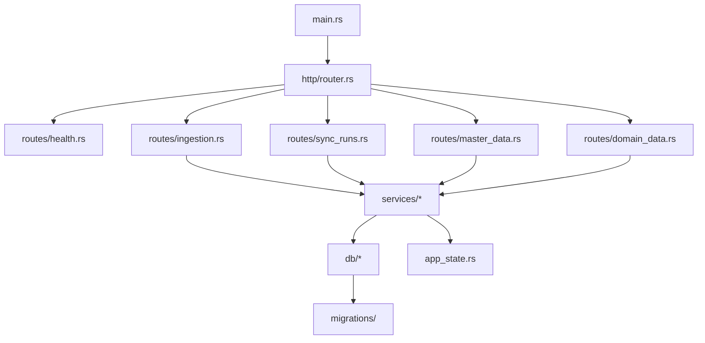

# 백엔드 코드 인덱스

- 문서 목적: 현재 `backend/` 소스 구조를 문서 관점에서 빠르게 탐색할 수 있도록 엔트리포인트, 책임 모듈, 주요 API 범위를 정리한다.
- 범위: `backend/src/`, `backend/tests/`, Rust `axum + sqlx` 백엔드의 현재 코드 기준 구조
- 대상 독자: 백엔드 개발자, 프론트엔드 개발자, 아키텍트, 운영자
- 상태: draft
- 최종 수정일: 2026-04-17
- 관련 문서: `current_backend_implementation_status_summary.md`, `integration_backend_design_plan.md`, `integration_backend_api_and_batch_contract_draft.md`, `../operations/backend_operation_ui_render_and_scenarios.md`

## 문서 위치

- 위키 홈: [../README.md](../README.md)
- 아키텍처 위키: [./README.md](./README.md)
- 구현 현황 요약: [./current_backend_implementation_status_summary.md](./current_backend_implementation_status_summary.md)

## 1. 한눈에 보는 구조

현재 백엔드는 `axum` 기반 HTTP API 를 중심으로, 수집 파이프라인 서비스와 기준정보/도메인 읽기 모델을 한 저장소 안에서 관리한다. 구조는 크게 `HTTP 진입점`, `애플리케이션 상태`, `서비스 계층`, `DB/마이그레이션`, `테스트` 로 구분된다.

## 2. 주요 엔트리포인트

| 경로 | 역할 | 비고 |
| --- | --- | --- |
| `backend/src/main.rs` | 프로세스 시작점, 설정 로드, 라우터 기동 | 기본 바인드 주소는 `127.0.0.1:8080` |
| `backend/src/config.rs` | 환경 변수 기반 설정 로드 | DB URL, 바인드 주소, 비밀키 등 |
| `backend/src/http/router.rs` | 전체 라우터 조립 | `/api/v1`, `/api/v1/admin` 하위 라우트 연결 |
| `backend/src/app_state.rs` | 공유 상태와 저장소 접근 추상화 | DB 풀 유무에 따라 DB 또는 인메모리 저장소 사용 |

## 3. HTTP 라우트 인덱스

### 3.1 공통/수집 API

| 파일 | 주요 경로 | 책임 |
| --- | --- | --- |
| `backend/src/http/routes/health.rs` | `GET /api/v1/health` | 서버 생존 확인 |
| `backend/src/http/routes/ingestion.rs` | `POST /api/v1/ingestion/events` | 외부 시스템 `push` 이벤트 수집 시작 |

### 3.2 운영 관리자 API

| 파일 | 주요 경로 | 책임 |
| --- | --- | --- |
| `backend/src/http/routes/sync_runs.rs` | `POST/GET /api/v1/admin/sync-runs`, `GET /api/v1/admin/sync-runs/{run_id}`, `POST /retry`, `POST /cancel` | 수동 동기화 실행 생성, 목록/상세, 재시도, 취소 |
| `backend/src/http/routes/master_data.rs` | `/api/v1/admin/master-data/organizations*`, `/workforce*` | 조직/인력 기준정보 조회, 등록, 수정, 이력/구조 조회 |
| `backend/src/http/routes/domain_data.rs` | `GET /api/v1/admin/projects`, `GET /api/v1/admin/work-items` | 프로젝트/업무 항목 읽기 모델 조회 |

### 3.3 `master_data.rs` 세부 범위

현재 `master_data.rs` 는 단순 목록 조회를 넘어 다음 운영 동작을 포함한다.

- 조직 목록 조회 및 등록/수정/삭제
- 조직 변경 이력 조회
- 조직 구조 조회
- 조직 직속 구성원 목록 조회 및 등록
- 조직 구성원 이동 이력 조회
- 인력 목록 조회 및 등록/수정/비활성화

즉 이 브랜치의 백엔드는 운영 UI 가 조직/인력 관리용 액션 폼을 붙일 수 있는 최소 관리자 표면을 이미 제공한다.

## 4. 서비스 계층 인덱스

| 경로 | 역할 |
| --- | --- |
| `backend/src/services/pull_sync.rs` | 외부 시스템 `pull` 동기화 오케스트레이션 |
| `backend/src/services/push_ingestion.rs` | 외부 시스템 `push` 이벤트 처리 |
| `backend/src/services/raw_ingestion.rs` | 원시 적재 이벤트 저장, 중복/최신성 판정 |
| `backend/src/services/normalization.rs` | 외부 데이터의 내부 표준 모델 정규화 |
| `backend/src/services/identity_mapping.rs` | 외부 식별자와 내부 기준키 매핑 |
| `backend/src/services/reference_resolution.rs` | 참조 무결성 해소와 `pending_reference` 재평가 |
| `backend/src/services/organization_write.rs` | 조직 기준정보 반영 |
| `backend/src/services/workforce_write.rs` | 인력 기준정보 반영 |
| `backend/src/services/project_write.rs` | 프로젝트 도메인 반영 |
| `backend/src/services/work_item_write.rs` | 업무 항목 도메인 반영 |
| `backend/src/services/master_data.rs` | 관리자 기준정보 조회/변경용 서비스 |
| `backend/src/services/domain_read.rs` | 프로젝트/업무 항목 조회 모델 서비스 |
| `backend/src/services/sync_runs.rs` | 동기화 실행 생성/조회/상태 전이 |

## 5. 저장소와 상태 관리

### 5.1 DB 중심 구조

- `backend/src/db/` 는 `sqlx` 기반 저장소 구현과 쿼리 매핑을 담당한다.
- `migrations/` 는 누적 마이그레이션 기준으로 관리한다.
- 실제 운영 조회 API 는 DB 풀이 있을 때 DB 기반 저장소를 사용한다.

### 5.2 인메모리 보조 구조

`app_state.rs` 는 DB 풀이 없는 테스트 또는 일부 검증 환경에서도 계약을 확인할 수 있도록 인메모리 저장소를 함께 유지한다. 다만 `projects`, `work-items` 같은 읽기 모델 일부는 DB 가 없으면 `503 SERVICE_UNAVAILABLE` 계약을 반환한다.

## 6. 테스트 기준선

| 경로 | 역할 |
| --- | --- |
| `backend/tests/` | 통합 테스트와 주요 API 계약 검증 |
| `backend/src/.../tests` | 모듈 단위 테스트 |

현재 문서 관점의 핵심 포인트는 다음과 같다.

- 조직/인력 기준정보와 `sync-runs` 는 운영 UI 연결을 전제로 계약이 확장된 상태다.
- 읽기 모델 일부는 DB 의존성이 남아 있으므로, UI 문서에도 빈 상태와 `503` 가능성을 함께 설명해야 한다.

## 7. 문서 동기화 시 함께 봐야 할 파일

- API 범위가 바뀌면: `current_backend_implementation_status_summary.md`
- 운영자가 쓰는 화면 흐름이 바뀌면: `../operations/backend_operation_ui_render_and_scenarios.md`
- 설계 의도가 바뀌면: `integration_backend_design_plan.md`, `integration_backend_api_and_batch_contract_draft.md`

## 8. 현재 남아 있는 문서 공백

- 서비스별 입력/출력 모델과 실패 계약을 정리한 세부 API 카탈로그는 아직 없다.
- DB 스키마와 서비스 책임을 1:1 로 추적하는 저장소 인덱스 문서는 아직 없다.
- 운영 UI 액션과 백엔드 엔드포인트를 매핑한 표는 후속으로 별도 문서화할 가치가 있다.

## 다음에 읽을 문서

- 운영 UI 시나리오: [../operations/backend_operation_ui_render_and_scenarios.md](../operations/backend_operation_ui_render_and_scenarios.md)
- 백엔드 구현 현황 요약: [./current_backend_implementation_status_summary.md](./current_backend_implementation_status_summary.md)
- 백엔드 설계 플랜: [./integration_backend_design_plan.md](./integration_backend_design_plan.md)
