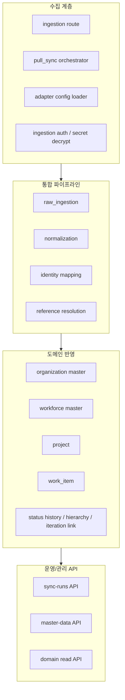

# 통합 백엔드 구현 현황 요약

- 문서 목적: 2026-04-08 시점의 데이터 통합 백엔드 구현 범위, 실행 흐름, 남은 공백을 한눈에 정리한다.
- 범위: `backend/` 구현 상태, 주요 API, 데이터 통합 파이프라인, 운영 UI 준비 전 점검 결과
- 대상 독자: 백엔드 개발자, 프론트엔드 개발자, 아키텍트, 운영자
- 상태: draft
- 최종 수정일: 2026-04-08
- 관련 문서: `docs/architecture/integration_backend_design_plan.md`, `docs/architecture/integration_backend_implementation_rollout_and_checklist_draft.md`, `docs/architecture/service_classification_and_msa_assessment_draft.md`, `docs/operations/backlog/2026-04-08.md`

## 문서 위치

- 위키 홈: [../README.md](../README.md)
- 아키텍처 위키: [./README.md](./README.md)
- 구현 체크리스트: [./integration_backend_implementation_rollout_and_checklist_draft.md](./integration_backend_implementation_rollout_and_checklist_draft.md)

## 1. 한눈에 보는 현재 상태

현재 백엔드는 단순 스캐폴딩 단계를 넘어, 데이터 통합의 핵심 수직 슬라이스를 이미 실행 가능한 형태로 갖췄다. `pull` 과 `push` 모두 원시 적재, 표준화, 식별자 매핑, 참조 해소, 도메인 반영까지 연결되어 있고, 조직/인사 기준정보도 동일 파이프라인 안에서 자동 반영된다.

운영 관점에서도 최소 관리자 API 는 확보됐다. `sync-runs`, `master-data`, `projects`, `work-items` 조회가 가능하므로, 운영 UI 는 이제 완전히 빈 상태가 아니라 이 API 들을 연결하는 단계로 진입할 수 있다.

## 2. 구현된 런타임 흐름

## 3. 모듈 구성 요약

## 4. 구현 상태 요약표

| 영역 | 현재 상태 | 비고 |
| --- | --- | --- |
| 개발 환경 | 구현됨 | 공통 개발/테스트 진입점 문서화 완료. 실제 호스트별 검증 이력은 `docs/operations/environments/` 참고 |
| 마이그레이션 체계 | 구현됨 | `sqlx migrate` 기준 누적 마이그레이션 운영 중 |
| 어댑터 설정 로더 | 구현됨 | DB 기반 설정 로드와 자격증명 복호화 연결 |
| `pull` 수집 | 구현됨 | 실행 생성, 원시 적재, 후처리까지 연결 |
| `push` 수집 | 구현됨 | `ingestion/events` 서명 검증과 후처리 연결 |
| 실행 이력 `sync_runs` | 구현됨 | 생성, 목록, 상세, 취소, 상태 종료 지원 |
| 원시 적재 | 구현됨 | 최신성, 중복, `pending_reference`, `stale` 판정 포함 |
| 표준화 | 구현됨 | `organization`, `workforce`, `project`, `issue` 최소선 반영 |
| 식별자 매핑 | 구현됨 | 외부 식별자와 내부 기준키 저장 |
| 참조 해소 | 구현됨 | `pending_reference` 재평가와 재승격 처리 |
| 조직 마스터 | 구현됨 | 관리자 API 수기 반영 + 수집 파이프라인 자동 반영 |
| 인력 마스터 | 구현됨 | 관리자 API 수기 반영 + 수집 파이프라인 자동 반영 |
| 프로젝트 반영 | 구현됨 | 주관 조직, 책임자 참조까지 연결 |
| 업무 항목 반영 | 구현됨 | 담당 조직, 담당자, 등록자 참조까지 연결 |
| 업무 항목 상태 이력 | 구현됨 | 상태 변경 시 최신 이력 적재 |
| 업무 항목 계층 | 구현됨 | 부모-자식 단일 링크 최소선 반영 |
| 계획 링크 | 부분 구현 | `iteration` 최소선만 연결, `release/milestone` 미구현 |
| 운영 조회 API | 구현됨 | `projects`, `work-items` 목록과 최소 필터 제공 |
| 운영 UI | 부분 구현 | `organization`, `admin` 화면에서 실제 운영 API 조회 가능, 등록/수정 액션은 아직 |
| 정합성 운영 플랫폼 | 미구현 | 이슈 큐, 재처리 운영 API, 대시보드는 후순위 |

## 5. 현재 제공 API 범위

### 5.1 수집/운영 API

- `POST /api/v1/ingestion/events`
- `POST /api/v1/admin/sync-runs`
- `GET /api/v1/admin/sync-runs`
- `GET /api/v1/admin/sync-runs/{run_id}`
- `POST /api/v1/admin/sync-runs/{run_id}/cancel`

### 5.2 기준정보/조회 API

- `GET /api/v1/admin/master-data/organizations`
- `POST /api/v1/admin/master-data/organizations`
- `GET /api/v1/admin/master-data/workforce`
- `POST /api/v1/admin/master-data/workforce`
- `GET /api/v1/admin/projects`
- `GET /api/v1/admin/work-items`

## 6. 리뷰 기준 점검 메모

이번 점검에서 확인한 핵심 판단은 다음과 같다.

- 구현된 파이프라인은 데이터 통합 백엔드의 1차 목표에 맞게 수직 슬라이스로 잘 이어져 있다.
- 운영 UI 연결 전에 필요한 최소 조회 API 도 확보됐고, `organization`/`admin` 정적 프로토타입은 실제 API 조회까지 연결됐다.
- 다만 운영 조회 API 는 데이터베이스가 없는 상태를 정상 빈 목록처럼 보이지 않게 해야 하며, 이번 점검에서 `503 SERVICE_UNAVAILABLE` 로 보정했다.
- 위키 인덱스 문서의 `최종 수정일` 과 핵심 문서 링크는 일부 누락이 있어 이번 점검에서 함께 정리했다.

## 7. 남은 공백과 다음 우선순위

### 7.1 데이터 통합 백엔드 관점 남은 공백

- `release`, `milestone` 등 계획 단위 확장
- 조직/인력/프로젝트/업무 항목의 필드 매핑 범위 확대
- 참조 무결성 이슈 큐와 재처리 운영 API 최소선
- 읽기 모델 정교화와 조회 성능 기준 수립

### 7.2 운영 UI 연결 전 준비 상태

운영 UI 구현을 시작하기 위한 최소 준비는 완료된 상태로 본다. 현재는 `organization`/`admin` 정적 프로토타입이 아래 API 를 실제로 조회할 수 있고, 다음 단계는 조회를 넘어 등록/수정/취소 액션까지 연결하는 것이다.

- `GET /api/v1/admin/sync-runs`
- `GET /api/v1/admin/master-data/organizations`
- `GET /api/v1/admin/master-data/workforce`
- `GET /api/v1/admin/projects`
- `GET /api/v1/admin/work-items`
