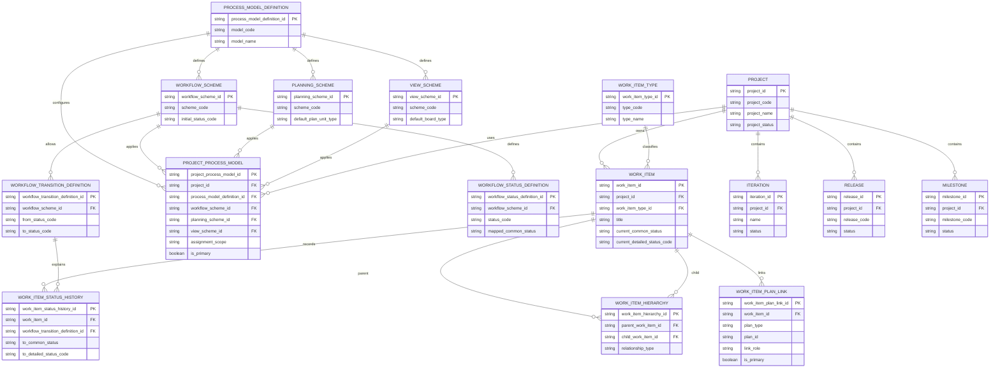
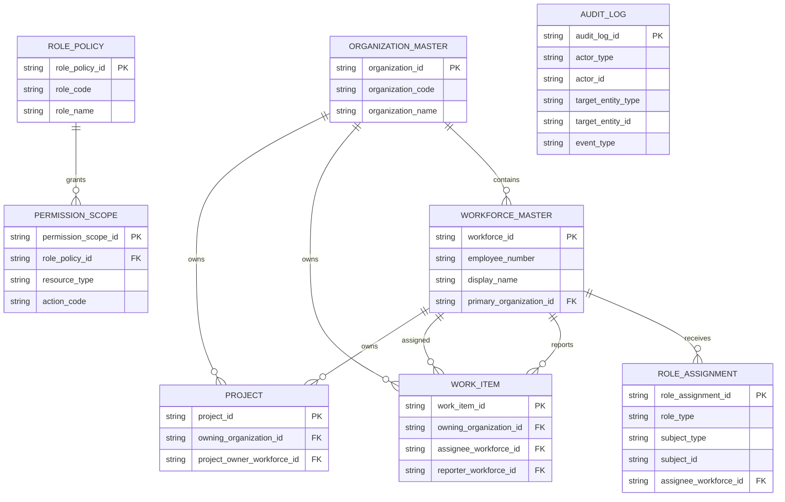

# 초기 릴리스 ERD 초안

- 문서 목적: 초기 릴리스 필수 엔터티를 기준으로 논리 `ERD` 초안을 제공한다.
- 범위: 공통 업무 관리, 상태 모델, 계획 연결, 조직/권한/감사 영역의 초기 릴리스 대상 엔터티 관계
- 대상 독자: 아키텍트, 개발자, 데이터 모델러, 기획자
- 상태: draft
- 최종 수정일: 2026-04-07
- 관련 문서: `docs/architecture/domain_entity_definition_draft.md`, `docs/architecture/domain_model_draft.md`, `docs/architecture/architecture_drafting_plan.md`

## 문서 위치

- 위키 홈: [../README.md](../README.md)
- 아키텍처 위키: [./README.md](./README.md)
- 엔터티 정의 초안: [./domain_entity_definition_draft.md](./domain_entity_definition_draft.md)

## 1. 문서 사용 원칙

- 본 문서는 물리 테이블 설계가 아니라 초기 릴리스 범위의 논리 `ERD` 초안이다.
- `Mermaid` 렌더링을 우선 기준으로 하며, 세부 제약은 설명 절에서 보완한다.
- 복잡도를 낮추기 위해 `업무/프로세스/계획` 과 `조직/권한/감사` 를 분리해 표시한다.
- `선택 포함` 또는 `후속 확장` 엔터티는 본 초안에서 제외한다.
- `type + id` 형태의 다형 참조는 정규 `FK` 관계선으로 과장하지 않고, 엔터티 속성과 보조 설명으로 표현한다.
- `planning_scheme` 과 계획 단위의 관계처럼 간접 상속 구조는 직접 소속 관계로 단순화하지 않고, 프로젝트 프로세스 설정을 통해 상속된다는 설명을 유지한다.

## 2. 업무/프로세스/계획 ERD

### 2.1 다형 참조와 간접 상속 메모

- `WORK_ITEM_PLAN_LINK`
  `ITERATION`, `RELEASE`, `MILESTONE` 와의 관계는 정규 `FK`가 아니라 `plan_type + plan_id` 기반의 논리 다형 참조로 본다. 따라서 다이어그램에는 직접 관계선을 넣지 않았다.
- `PLANNING_SCHEME`
  `ITERATION`, `RELEASE`, `MILESTONE` 을 직접 소유하지 않고, `PROJECT_PROCESS_MODEL` 을 통해 프로젝트에 상속되는 규칙 엔터티로 본다.
- `PROJECT_PROCESS_MODEL`
  프로젝트의 기본 프로세스 설정을 가지며, `WORK_ITEM` 은 기본적으로 이 설정을 상속한다.
  동일 시점 기준으로 `is_primary=true` 인 레코드가 프로젝트의 기본 프로세스 모델 해석 기준이 된다.
  `workflow_scheme`, `planning_scheme`, `view_scheme` 은 이 레코드에 연결된 활성 규칙 집합으로 해석한다.

## 3. 조직/권한/감사 ERD

### 3.1 다형 참조 메모

- `ROLE_ASSIGNMENT`
  역할이 연결되는 대상은 `subject_type + subject_id` 로 표현하는 논리 다형 참조이므로, 조직/프로젝트/업무 항목으로의 직접 관계선을 다이어그램에 모두 그리지 않았다.
- `ROLE_POLICY`
  현재 초안에서는 `ROLE_ASSIGNMENT.role_type` 이 `ROLE_POLICY.role_code` 체계와 논리적으로 정렬된다고 보고, 정규 `FK`는 아직 확정하지 않았다.
- `AUDIT_LOG`
  `actor_type + actor_id`, `target_entity_type + target_entity_id` 기반의 다형 참조이므로 특정 엔터티와의 직접 `FK` 관계로 고정하지 않았다.

## 4. 핵심 제약 메모

- `PROJECT_PROCESS_MODEL` 은 동일 시점에 `is_primary=true` 인 레코드가 프로젝트별로 하나만 존재해야 한다.
- `WORK_ITEM_HIERARCHY` 는 초기 모델에서 단일 부모 원칙과 순환 금지 제약을 둔다.
- `WORK_ITEM_STATUS_HISTORY` 는 최신 이력과 `WORK_ITEM.current_*_status` 가 모순되지 않도록 유지해야 한다.
- `WORK_ITEM_PLAN_LINK` 의 다중 연결 허용 여부는 `PLANNING_SCHEME` 규칙으로 검증해야 한다.
- `WORK_ITEM_PLAN_LINK.plan_type` 은 최소 `iteration`, `release`, `milestone` 집합과 일치해야 한다.
- `ROLE_ASSIGNMENT.subject_type/subject_id` 는 조직, 프로젝트, 업무 항목 등 다양한 대상에 연결될 수 있는 논리 다형 관계로 본다.
- `AUDIT_LOG.target_entity_type/target_entity_id` 도 논리 다형 참조로 본다.
- `AUDIT_LOG.actor_type/actor_id` 도 사용자, 시스템, 연계 프로세스를 포함하는 논리 다형 참조로 본다.

## 5. 다음 작업 후보

- 필수 엔터티 기준 물리 모델 초안 작성
- 다형 참조를 포함한 논리 참조 규칙 문서 작성
- `Mermaid` 기준 서브도메인별 다이어그램 추가 분리
- 선택 포함 엔터티를 포함한 확장 `ERD` 초안 작성
