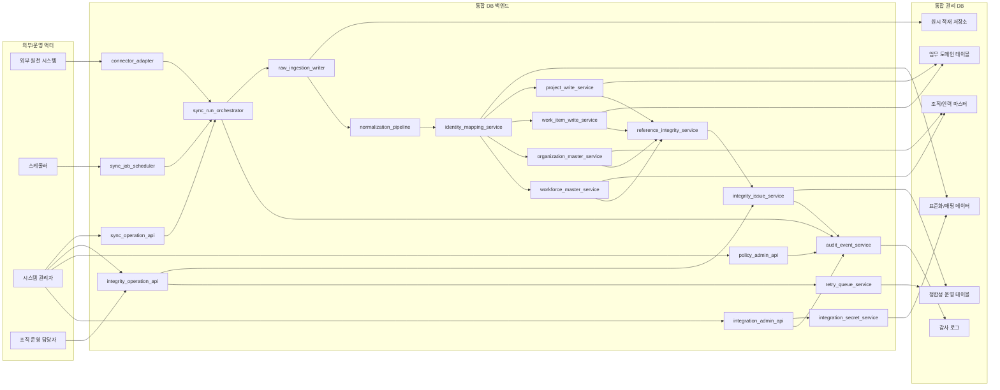
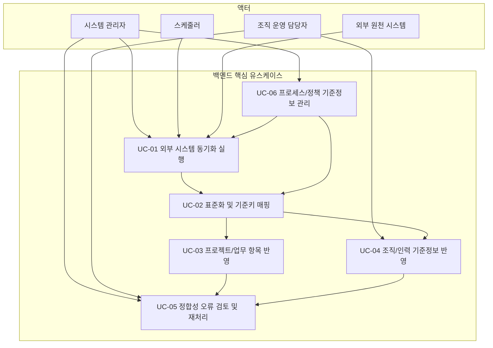

# 시스템 통합 DB 백엔드 컴포넌트 초안

- 문서 목적: 시스템 통합 DB 구축용 백엔드의 런타임 컴포넌트 경계, 책임, 상호작용, 핵심 유스케이스를 구현 관점에서 정리한다.
- 범위: 백엔드 모듈 분해, 수집/정규화/저장 책임, 운영 통제 컴포넌트, 초기 릴리스 유스케이스, `Mermaid` 다이어그램
- 대상 독자: 백엔드 개발자, 아키텍트, 데이터 엔지니어, 운영자
- 상태: draft
- 최종 수정일: 2026-04-07
- 관련 문서: `docs/architecture/integration_backend_design_plan.md`, `docs/architecture/system_context_and_integration_draft.md`, `docs/architecture/initial_release_ddl_draft.md`, `docs/architecture/polymorphic_reference_validation_draft.md`

## 문서 위치

- 위키 홈: [../README.md](../README.md)
- 아키텍처 위키: [./README.md](./README.md)
- 상위 계획 문서: [./integration_backend_design_plan.md](./integration_backend_design_plan.md)

## 1. 목적

본 문서는 시스템 통합 DB 구축용 백엔드를 실제 개발 단위로 분해하기 위한 초안이다. 기존 문서에서 정리한 도메인 모델과 `DDL` 은 저장 구조를 설명하지만, 백엔드 개발 관점에서는 어떤 컴포넌트가 어떤 데이터를 받아 어떤 책임으로 저장하고 운영하는지가 더 중요하다. 따라서 본 문서는 런타임 경계와 쓰기 책임을 먼저 고정하는 데 목적이 있다.

## 2. 설계 전제

- 외부 시스템은 원본 데이터와 실행 결과의 소스이며, 통합 플랫폼은 이를 표준화해 중앙 관리 `DB` 에 반영한다.
- 초기 릴리스는 화면보다 저장 구조와 수집/정규화/운영 통제 최소선을 먼저 닫는다.
- 읽기 최적화는 필요하지만, 초기 컴포넌트 초안의 중심은 쓰기 책임과 동기화 실행 책임이다.
- 다형 참조 무결성은 물리 `FK` 대신 서비스 검증과 운영 보완 구조로 관리한다.
- 운영자가 수동 개입하는 기능은 일반 업무 API 와 분리하고 관리자 성격의 실행 경계를 유지한다.

## 3. 백엔드 컴포넌트 분해

### 3.1 연계 어댑터 계층

- `connector_adapter`: 외부 시스템별 인증, 호출, 페이지네이션, 증분 조회 책임을 가진다.
- `source_pull_client`: 원천 시스템의 API, `DB`, 파일 기반 연계를 일관된 내부 요청 모델로 감싼다.
- `sync_cursor_manager`: 시스템별 마지막 동기화 지점과 증분 수집 기준을 관리한다.

이 계층은 외부 의존성을 캡슐화하고, 내부 표준 모델을 직접 알지 않는다.

### 3.2 동기화 오케스트레이션 계층

- `sync_job_scheduler`: 주기 실행, 수동 실행, 재실행 요청을 받아 잡을 생성한다.
- `sync_run_orchestrator`: 동기화 실행 단위를 생성하고, 수집 단계와 후속 단계를 순서대로 호출한다.
- `sync_run_state_manager`: 실행 상태, 실패 사유, 재시도 가능 여부를 기록한다.

이 계층은 “언제 어떤 동기화를 어떤 범위로 수행할 것인가”를 결정한다.

### 3.3 원시 적재 계층

- `raw_ingestion_writer`: 외부 시스템 응답과 수집 메타데이터를 원시 저장소에 적재한다.
- `raw_payload_catalog`: 원시 데이터 위치, 해시, 수집 시각, 원천 타입, 스키마 버전을 관리한다.
- `ingestion_error_recorder`: 수집 단계 실패를 구조화된 오류로 저장한다.

이 계층은 재처리와 감사 가능성을 위해 원천 데이터를 손상 없이 남기는 역할을 가진다.

### 3.4 표준화 및 식별자 매핑 계층

- `normalization_pipeline`: 원시 데이터를 내부 표준 속성으로 변환한다.
- `identity_mapping_service`: 외부 식별자와 내부 `project`, `work_item`, 조직/인력 기준키를 매핑한다.
- `reference_resolution_service`: 조직, 인력, 권한, 계획 단위 같은 참조 대상의 존재와 일관성을 검증한다.
- `integration_secret_service`: 외부 시스템 접속 정보와 자격증명을 암호화 저장, 복호화, 교체 검증한다.

이 계층은 원천별 차이를 줄이고, 내부 도메인 쓰기 서비스가 사용할 수 있는 표준 입력을 만든다.

### 3.5 도메인 쓰기 계층

- `project_write_service`: `project`, `project_process_model`, `release`, `milestone` 반영을 담당한다.
- `work_item_write_service`: `work_item`, `work_item_hierarchy`, `work_item_status_history`, `work_item_plan_link` 반영을 담당한다.
- `organization_master_service`: `organization_master`, 조직 관계, 조직 변경 반영 준비 데이터를 관리한다.
- `workforce_master_service`: `workforce_master`, 소속, 역할 기준정보를 반영한다.
- `workflow_definition_service`: `process_model_definition`, `workflow_scheme`, `planning_scheme`, `view_scheme` 와 코드값 기준을 관리한다.

이 계층은 실제 통합 관리 `DB` 의 업무 기준 데이터를 쓴다.

### 3.6 운영 통제 및 정합성 계층

- `reference_integrity_service`: 다형 참조와 간접 상속 기준의 동기 검증을 담당한다.
- `integrity_issue_service`: 정합성 오류 적재, 상태 전이, 수동 조치 이력을 관리한다.
- `retry_queue_service`: 재처리 대상을 큐에 적재하고 실행 이력을 남긴다.
- `audit_event_service`: 사용자/시스템 행위를 감사 로그로 기록한다.

이 계층은 초기 릴리스에서 가장 중요한 운영 안전장치 역할을 한다.

### 3.7 조회 및 운영 API 계층

- `sync_operation_api`: 동기화 실행, 실행 상태 조회, 실패 상세 조회를 제공한다.
- `integrity_operation_api`: 오류 목록, 오류 상세, 재처리 요청, 조치 이력 조회를 제공한다.
- `master_data_api`: 프로젝트, 업무 항목, 조직/인력 기준정보 조회와 제한된 수동 보정을 제공한다.
- `integration_admin_api`: 외부 시스템 URL, 인증 유형, 계정 `id`, 비밀번호/`token` 등의 연결 설정 등록/수정/검증을 제공한다.
- `policy_admin_api`: 역할 정책, 계획 규칙, 프로세스 정의의 관리 기능을 제공한다.

이 계층은 내부 사용자와 관리자 콘솔이 호출하는 진입점이다.

## 4. 컴포넌트별 1차 저장 책임

| 컴포넌트 | 1차 책임 데이터 | 비고 |
| --- | --- | --- |
| `sync_run_orchestrator` | 동기화 실행 이력, 실행 상태 | 외부 원천별 실행 단위 생성 |
| `raw_ingestion_writer` | 원시 적재 데이터, 원시 메타데이터 | 재처리와 감사 근거 |
| `normalization_pipeline` | 표준화 결과, 파싱 오류 | 임시 표준 모델 또는 메모리 파이프라인 |
| `identity_mapping_service` | 외부 식별자 매핑, 기준키 연결 | 프로젝트/업무/조직/인력 공통 |
| `integration_secret_service` | 암호화 자격증명, 연결 검증 이력 | 평문 비노출 원칙 |
| `project_write_service` | `project`, `release`, `milestone` | 상위 관리 단위 반영 |
| `work_item_write_service` | `work_item`, 계층, 상태 이력, 계획 링크 | 핵심 업무 항목 반영 |
| `organization_master_service` | 조직 마스터, 조직 변경 준비 정보 | 인사 원천 반영 |
| `workforce_master_service` | 인력 마스터, 소속, 역할 기준정보 | 계정/권한 연계 기반 |
| `reference_integrity_service` | 참조 검증 결과, 오류 이벤트 | 즉시 검증과 운영 이슈 연결 |
| `retry_queue_service` | 재처리 큐, 재시도 실행 정보 | 운영 보완 경로 |

## 5. 초기 릴리스 핵심 유스케이스

### 5.1 외부 시스템 동기화 실행

- 액터: 시스템 관리자, 스케줄러
- 목표: 외부 시스템 데이터를 증분 또는 전체 범위로 수집해 중앙 `DB` 에 반영한다.
- 주요 컴포넌트: `sync_job_scheduler`, `sync_run_orchestrator`, `connector_adapter`, `raw_ingestion_writer`, `normalization_pipeline`

### 5.2 표준화 및 기준키 매핑

- 액터: 시스템 관리자, 연계 배치
- 목표: 수집된 원시 데이터를 내부 표준 모델로 변환하고 업무 기준키와 연결한다.
- 주요 컴포넌트: `normalization_pipeline`, `identity_mapping_service`, `reference_resolution_service`

### 5.3 프로젝트/업무 항목 반영

- 액터: 연계 배치
- 목표: 표준화 결과를 `project`, `work_item`, 상태 이력, 계획 연결 구조에 반영한다.
- 주요 컴포넌트: `project_write_service`, `work_item_write_service`

### 5.4 조직/인력 기준정보 반영

- 액터: 시스템 관리자, 조직 운영 담당자, 연계 배치
- 목표: 인사 원천과 계정계 정보를 기준으로 조직/인력 마스터를 갱신한다.
- 주요 컴포넌트: `organization_master_service`, `workforce_master_service`, `identity_mapping_service`

### 5.5 정합성 오류 검토 및 재처리

- 액터: 시스템 관리자, 운영 관리자
- 목표: 누락/불일치 참조를 검토하고 수동 조치 또는 재처리를 실행한다.
- 주요 컴포넌트: `reference_integrity_service`, `integrity_issue_service`, `retry_queue_service`, `integrity_operation_api`

### 5.6 정책/기준정보 관리

- 액터: 시스템 관리자
- 목표: 프로세스 모델, 워크플로우, 계획 규칙, 역할 정책을 관리한다.
- 주요 컴포넌트: `workflow_definition_service`, `policy_admin_api`, `audit_event_service`

### 5.7 외부 시스템 연결 정보 및 자격증명 관리

- 액터: 시스템 관리자
- 목표: 외부 시스템 연결 URL, 인증 유형, 계정 `id`, 비밀번호/`token` 을 등록, 수정, 검증, 비활성화한다.
- 주요 컴포넌트: `integration_admin_api`, `integration_secret_service`, `audit_event_service`

## 6. Mermaid 컴포넌트 다이어그램

## 7. Mermaid 유스케이스 다이어그램

## 8. 초기 구현 순서 관점의 경계

### 8.1 1차 구현

- `sync_job_scheduler`
- `sync_run_orchestrator`
- `connector_adapter`
- `raw_ingestion_writer`
- `normalization_pipeline`
- `identity_mapping_service`
- `project_write_service`
- `work_item_write_service`

이 구간이 완성돼야 중앙 통합 `DB` 에 프로젝트와 업무 항목이 실제로 쌓이기 시작한다.

### 8.2 2차 구현

- `organization_master_service`
- `workforce_master_service`
- `reference_integrity_service`
- `integrity_issue_service`
- `retry_queue_service`

이 구간이 완성돼야 조직/권한 기준정보와 운영 보완 구조가 안정화된다.

### 8.3 3차 구현

- `sync_operation_api`
- `integrity_operation_api`
- `policy_admin_api`
- 읽기 모델/조회 API

이 구간은 관리자 콘솔과 운영 화면을 연결하는 진입점이다.

## 9. 후속 상세화 후보

- 연계 수집/정규화/저장 시퀀스 다이어그램
- 동기화 실행 이력과 잡 상태 모델 상세화
- 초기 백엔드 API 계약 초안
- 마이그레이션 및 시드 데이터 운영 전략
