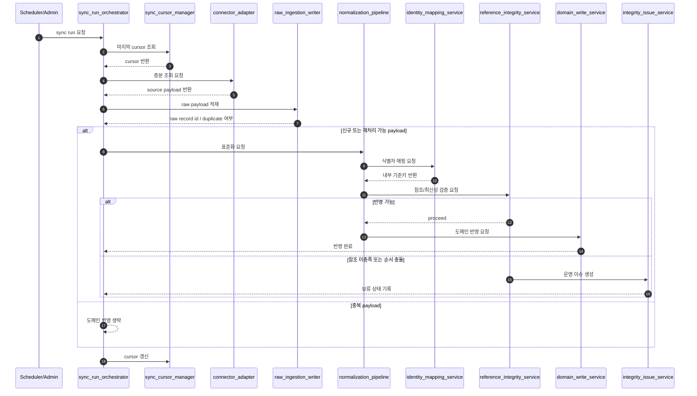
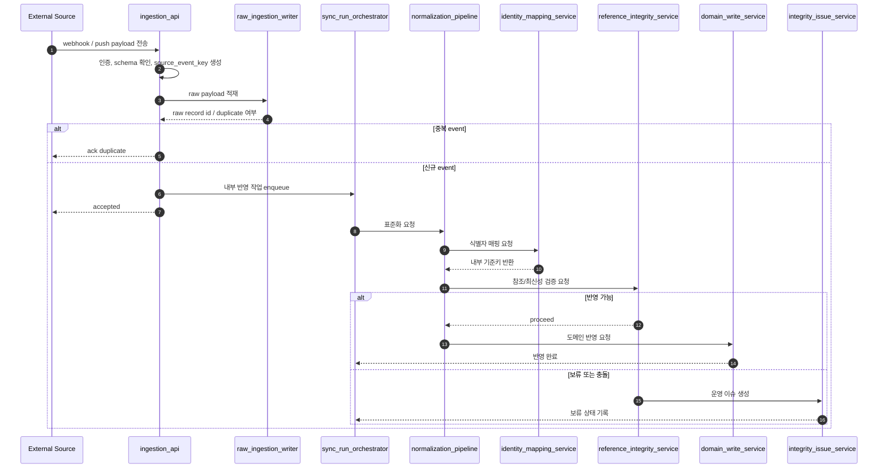

# 시스템 통합 DB 데이터 수집 시퀀스 초안

- 문서 목적: `pulling` 방식 수집과 `API push` 수신을 함께 수용하는 통합 데이터 수집 시퀀스와 정합성/충돌 방지 구조를 정리한다.
- 범위: 수집 진입 방식, 공통 적재 파이프라인, 멱등 처리, 순서 보장, 충돌 방지, 오류 처리, `Mermaid` 시퀀스 다이어그램
- 대상 독자: 백엔드 개발자, 아키텍트, 데이터 엔지니어, 운영자
- 상태: draft
- 최종 수정일: 2026-04-07
- 관련 문서: `docs/architecture/integration_backend_design_plan.md`, `docs/architecture/integration_backend_component_draft.md`, `docs/architecture/polymorphic_reference_validation_draft.md`, `docs/architecture/reference_integrity_batch_and_error_queue_draft.md`

## 문서 위치

- 위키 홈: [../README.md](../README.md)
- 아키텍처 위키: [./README.md](./README.md)
- 상위 계획 문서: [./integration_backend_design_plan.md](./integration_backend_design_plan.md)

## 1. 목적

시스템 통합 DB 백엔드는 외부 시스템에서 데이터를 가져오는 `pulling` 방식과 외부 시스템이 데이터를 전달하는 `API push` 방식을 모두 지원할 수 있어야 한다. 이때 가장 큰 위험은 같은 원천 데이터가 중복 반영되거나, 더 오래된 이벤트가 나중에 도착해 최신 상태를 덮어쓰는 문제다. 본 문서는 두 수집 방식을 하나의 공통 적재 파이프라인으로 수렴시키고, 정합성과 충돌 방지를 우선하는 수집 구조를 정의한다.

## 2. 설계 원칙

- 수집 진입 방식이 다르더라도 내부 반영 경로는 하나의 표준 파이프라인으로 수렴한다.
- 원시 적재와 도메인 반영을 분리해 재처리와 감사 가능성을 확보한다.
- 같은 데이터는 `source_system + source_object_type + source_object_id + source_event_key` 기준으로 멱등 처리한다.
- 최신성 판정은 수신 시각이 아니라 원천 버전, 원천 수정 시각, 원천 시퀀스 번호를 우선 사용한다.
- 도메인 테이블에 직접 경쟁 쓰기를 허용하지 않고, 표준화 이후 단일 쓰기 서비스만 반영한다.
- 참조 무결성 미충족이나 순서 역전은 즉시 실패 또는 보류 상태로 적재하고 재처리 경로를 제공한다.

## 3. 공통 수집 파이프라인

### 3.1 공통 단계

1. 수집 요청 접수
2. 수집 실행 단위 생성
3. 원시 데이터 적재
4. 중복/재전송 판정
5. 표준화 변환
6. 식별자 매핑 및 참조 확인
7. 최신성 및 충돌 판정
8. 도메인 쓰기 반영
9. 감사 로그/운영 이슈 기록

### 3.2 `pulling` 과 `API push` 의 차이

- `pulling`: 내부 스케줄러 또는 수동 실행이 외부 원천에 조회 요청을 보낸다.
- `API push`: 외부 시스템이 웹훅 또는 배치 호출로 내부 수신 엔드포인트에 전달한다.

두 경우 모두 3단계 이후에는 동일한 적재/표준화/반영 경로를 사용한다.

## 4. 충돌 방지와 정합성 제어 구조

### 4.1 멱등 수집 키

원시 적재 단계에서 다음 조합을 멱등 기준으로 본다.

- `source_system`
- `source_object_type`
- `source_object_id`
- `source_event_key`

`source_event_key` 는 가능한 경우 다음 우선순위로 생성한다.

1. 외부 시스템 제공 이벤트 `id`
2. 외부 시스템 변경 시퀀스 번호
3. `object_id + source_version`
4. `object_id + source_updated_at + payload_hash`

같은 키가 다시 들어오면 원시 적재는 허용하되, 도메인 반영은 중복 반영하지 않는다.

### 4.2 최신성 판정 규칙

같은 업무 대상에 대한 반영 충돌은 다음 우선순위로 판정한다.

1. `source_version`
2. `source_sequence_no`
3. `source_updated_at`
4. `ingested_at`

더 낮은 우선순위의 데이터가 늦게 도착해도, 이미 더 높은 최신성 데이터가 반영된 경우 도메인 쓰기를 생략하고 “지연 도착” 이력만 남긴다.

### 4.3 단일 쓰기 경로 원칙

- `pull` 과 `push` 모두 원시 적재까지만 분기한다.
- 표준화 이후에는 `project_write_service`, `work_item_write_service`, 조직/인력 쓰기 서비스만 도메인 테이블을 갱신할 수 있다.
- 운영 수동 보정도 동일 쓰기 서비스 API 를 통해서만 반영한다.

이 구조로 직접 테이블 업데이트로 인한 충돌을 막는다.

### 4.4 엔터티 단위 직렬화

다음 키 범위에서는 동시 반영을 직렬화한다.

- `project`
- `work_item`
- `organization_master`
- `workforce_master`

직렬화 방식은 구현 시점에 선택하되, 최소 요구는 다음과 같다.

- 동일 기준키에 대한 반영은 같은 시점에 1개 파이프라인만 `commit`
- 이전 반영이 끝나기 전 후속 반영은 대기 또는 보류
- 보류된 항목은 재처리 큐로 이동 가능

### 4.5 참조 보류와 재처리

업무 항목이 프로젝트보다 먼저 들어오거나, 조직/인력 참조가 아직 없는 경우 즉시 폐기하지 않는다.

- 원시 적재: 성공
- 표준화: 성공
- 참조 검증: 보류
- 운영 이슈: 생성
- 재처리 큐: 적재

이 구조로 순서 역전이 있어도 데이터 유실 없이 보완할 수 있다.

## 5. `pulling` 수집 시퀀스

### 5.1 설명

`pulling` 은 스케줄러 또는 관리자 수동 실행으로 시작한다. 외부 원천 조회 범위는 마지막 커서, 증분 토큰, 조회 기간으로 결정한다. 수집 결과는 원시 적재 후 표준화 파이프라인으로 전달된다.

### 5.2 Mermaid 시퀀스 다이어그램

## 6. `API push` 수신 시퀀스

### 6.1 설명

`API push` 는 외부 시스템의 웹훅, 변경 이벤트, 배치 전송으로 시작한다. 수신 시점에는 빠른 인증, 스키마 확인, 기본 멱등 확인까지만 수행하고, 도메인 반영은 내부 파이프라인으로 위임한다.

### 6.2 Mermaid 시퀀스 다이어그램

## 7. `pull` 과 `push` 동시 수용 시 충돌 방지 규칙

### 7.1 동일 원천, 동일 객체

같은 외부 시스템이 어떤 객체를 `push` 로 보내고 동시에 `pull` 로도 조회되는 경우가 있을 수 있다. 이 경우 다음 원칙을 적용한다.

- 반영 기준은 이벤트 도착 순서가 아니라 원천 최신성 필드다.
- 원시 적재는 둘 다 허용한다.
- `source_event_key` 가 같으면 중복으로 처리한다.
- `source_event_key` 가 달라도 `source_version` 이 같으면 동일 버전으로 간주해 한 번만 반영한다.

### 7.2 동일 내부 기준키에 대한 경쟁 반영

- `work_item`, `project` 기준으로 낙관적 버전 검사 또는 행 단위 직렬화가 필요하다.
- 쓰기 시점에는 현재 저장된 `last_applied_source_version` 보다 낮은 이벤트를 반영하지 않는다.
- 같은 버전의 서로 다른 payload 가 들어오면 충돌 이슈로 전환하고 수동 검토 대상으로 보낸다.

### 7.3 부분 순서 문제

예를 들어 `project` 생성 전에 `work_item` 이 도착할 수 있다. 이 경우:

- 상위 참조가 없는 하위 데이터는 `pending_reference` 로 적재
- 상위 참조가 생기면 재처리 큐에서 재평가
- 재처리 실패가 반복되면 운영 이슈 심각도를 상향

## 8. 초기 릴리스 권장 저장 필드

정합성/충돌 방지를 위해 최소한 다음 메타데이터가 필요하다.

- `source_system`
- `source_object_type`
- `source_object_id`
- `source_event_key`
- `source_version`
- `source_sequence_no`
- `source_updated_at`
- `payload_hash`
- `ingested_at`
- `last_applied_source_version`
- `last_applied_payload_hash`

## 9. 구현 시 주의사항

- `push` 엔드포인트는 빠르게 `ack` 하되, 도메인 반영 완료를 응답에 포함시키지 않는다.
- `pull` 과 `push` 의 파싱/표준화 로직을 따로 두지 말고 공통 `normalization_pipeline` 으로 수렴시킨다.
- 재처리도 신규 적재와 같은 검증 규칙을 사용해야 한다.
- 운영 수동 보정은 외부 최신성 규칙을 우회하지 않도록 별도 감사 코드와 예외 승인 경로를 거친다.

## 10. 후속 상세화 후보

- 동기화 실행 이력과 잡 상태 전이 정의
- `ingestion_api` 계약과 인증 방식
- 원시 적재 테이블/큐 물리 모델 보강
- `last_applied_source_version` 관리 전략 상세화
