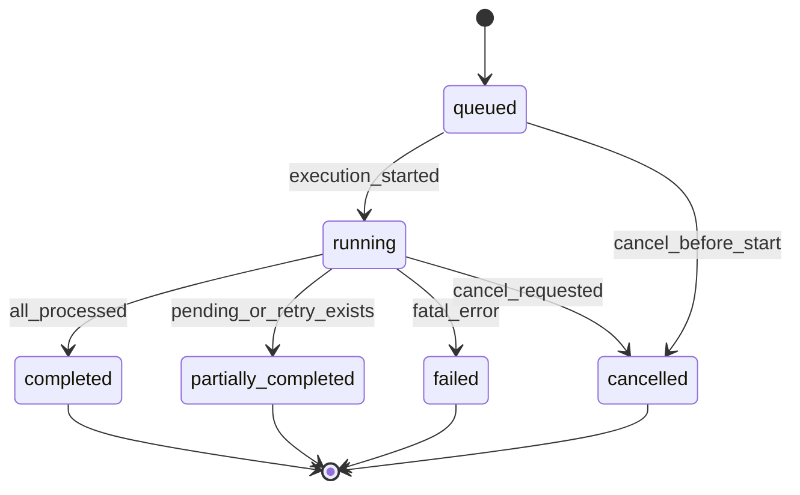

# 시스템 통합 DB 동기화 실행 상태 전이 초안

- 문서 목적: `sync_run`/`integration_run` 관점의 실행 상태, 전이 규칙, 재시도/취소/부분 실패 처리 기준을 정리한다.
- 범위: 실행 상태 집합, 상태 전이 규칙, 이벤트별 전이, 금지 전이, API 표시 상태, 운영 처리 기준
- 대상 독자: 백엔드 개발자, 아키텍트, 운영자, QA
- 상태: draft
- 최종 수정일: 2026-04-07
- 관련 문서: `docs/architecture/integration_backend_api_and_batch_contract_draft.md`, `docs/architecture/integration_data_ingestion_sequence_draft.md`, `docs/architecture/initial_release_physical_model_draft.md`, `docs/architecture/initial_release_ddl_draft.md`

## 문서 위치

- 위키 홈: [../README.md](../README.md)
- 아키텍처 위키: [./README.md](./README.md)
- 상위 계획 문서: [./integration_backend_design_plan.md](./integration_backend_design_plan.md)

## 1. 목적

본 문서는 동기화 실행 단위가 어떤 상태를 거치고 언제 재시도, 취소, 부분 실패, 보류로 분기하는지 정리한다. 관리자 API 에 보이는 `sync_run` 과 내부 저장 모델의 `integration_run` 은 같은 실행 단위를 다른 관점에서 표현하므로, 둘 사이의 상태 해석 차이를 최소화하는 것이 목적이다.

## 2. 모델링 원칙

- 저장 상태와 화면 표시 상태를 분리하지 않고 가능한 한 같은 상태 집합을 사용한다.
- 상태는 실행 단위 전체 기준으로 정의하고, 개별 레코드 실패는 집계 또는 하위 오류 엔터티로 표현한다.
- 재시도는 새 실행 단위를 생성하되, 원래 실행 단위와의 계보를 남긴다.
- “부분 성공” 은 성공으로 숨기지 않고 별도 상태로 드러낸다.
- 취소와 실패는 구분한다.

## 3. 기본 상태 집합

### 3.1 권장 상태

- `queued`
- `running`
- `partially_completed`
- `completed`
- `failed`
- `cancelled`

### 3.2 상태 의미

- `queued`: 실행 요청은 접수됐지만 아직 실제 수집/반영을 시작하지 않은 상태
- `running`: 수집, 원시 적재, 표준화, 도메인 반영 중 하나 이상이 진행 중인 상태
- `partially_completed`: 실행은 종료됐지만 일부 대상이 보류, 실패, 재처리 대기 상태로 남은 상태
- `completed`: 실행이 정상 종료됐고 잔여 보류/실패 대상이 없는 상태
- `failed`: 실행 자체가 비정상 종료되어 전체 또는 핵심 단계가 완료되지 못한 상태
- `cancelled`: 운영자 또는 시스템 정책에 의해 실행이 중단된 상태

## 4. 상태 전이 규칙

### 4.1 정상 전이

- `queued -> running`
- `running -> completed`
- `running -> partially_completed`
- `running -> failed`
- `queued -> cancelled`
- `running -> cancelled`

### 4.2 후속 조치 전이

- `partially_completed -> queued`
  재처리용 새 실행 단위를 생성하는 경우
- `failed -> queued`
  재시도용 새 실행 단위를 생성하는 경우

원래 실행 단위의 상태를 다시 바꾸기보다, 후속 실행을 새로 생성하는 편이 권장된다.

### 4.3 금지 전이

- `completed -> running`
- `completed -> failed`
- `cancelled -> running`
- `failed -> running`
- `partially_completed -> running`

종료 상태를 가진 기존 실행 단위는 재개하지 않고, 별도 재시도 실행으로 이어져야 한다.

## 5. 단계별 상태 해석

### 5.1 `queued`

- `sync_operation_api` 또는 스케줄러가 실행 요청을 접수함
- 멱등 키 확인 완료
- 아직 실제 원시 적재 시작 전

### 5.2 `running`

- 외부 수집 호출 수행 중
- 원시 적재 수행 중
- 표준화/식별자 매핑 수행 중
- 도메인 반영 수행 중

### 5.3 `partially_completed`

다음 중 하나 이상이 있으면 이 상태를 고려한다.

- 일부 레코드가 `pending_reference`
- 일부 레코드가 `retry_scheduled`
- 일부 원시 레코드가 표준화 실패
- 일부 도메인 반영이 최신성 충돌로 보류

즉, 실행 자체는 끝났지만 후속 운영 액션 없이는 완전 종료가 아닌 경우다.

### 5.4 `completed`

- 실행 대상 범위가 모두 처리됨
- 보류/실패 건수가 0
- 후속 재처리 큐 적재가 없음

### 5.5 `failed`

다음 경우는 `failed` 로 본다.

- 외부 원천 인증 실패로 전체 실행 중단
- 커서 조회 또는 원천 호출 자체 실패
- 원시 적재 저장 실패
- 표준화 파이프라인 전체 장애
- 트랜잭션 실패로 핵심 도메인 반영 불가

### 5.6 `cancelled`

- 운영자가 실행 취소 요청
- 시스템 정책에 의해 장시간 실행 중단
- 상위 배치 제어 정책에 의한 중지

## 6. Mermaid 상태 다이어그램

## 7. 이벤트별 전이 기준

### 7.1 시작 이벤트

- `sync_run_requested`: 상태 없음 -> `queued`
- `worker_acquired`: `queued` -> `running`

### 7.2 성공 이벤트

- `all_records_committed`: `running` -> `completed`

### 7.3 부분 완료 이벤트

- `pending_reference_detected`
- `retry_queue_enqueued`
- `partial_normalization_failure`

위 이벤트가 있고 실행 종료가 되면 `running` -> `partially_completed`

### 7.4 실패 이벤트

- `source_auth_failed`
- `source_unreachable`
- `raw_storage_failed`
- `normalization_pipeline_failed`
- `domain_write_fatal_error`

위 이벤트가 발생하고 핵심 단계 완료가 불가하면 `running` -> `failed`

### 7.5 취소 이벤트

- `operator_cancel_requested`
- `timeout_cancelled`
- `scheduler_cancelled`

## 8. API 표시 상태와 내부 상태 매핑

### 8.1 관리자 API 응답

- `queued`
- `running`
- `partially_completed`
- `completed`
- `failed`
- `cancelled`

보조 응답 규칙:

- 취소 요청 API 는 종료 상태를 만나면 상태 변경 없이 현재 상태와 `status_reason_code` 를 반환할 수 있다.
- 재시도 API 는 종료 상태 중 `failed`, `partially_completed`, 일부 `cancelled` 만 재시도 가능 대상으로 본다.
- `RUN_ALREADY_FINISHED`, `RUN_NOT_CANCELLABLE`, `RUN_NOT_RETRIABLE` 는 실행 상태가 아니라 운영 API 오류/응답 코드다.

초기 API 계약 문서의 `accepted`, `queued`, `running`, `completed`, `failed`, `ignored` 중 `ignored` 는 실행 상태보다는 개별 이벤트 처리 결과에 가깝다. 따라서 `sync_run` 전체 상태에는 쓰지 않는 편이 맞다.

### 8.2 `ingestion_api` 응답의 `ignored`

`ignored` 는 다음 경우에만 사용한다.

- 중복 이벤트라서 새 실행 단위를 만들지 않은 경우
- 이미 더 최신 버전이 반영돼 도메인 반영을 생략한 경우

즉, `ignored` 는 `integration_run.run_status` 가 아니라 요청 처리 결과 코드로 해석해야 한다.

## 9. 집계 규칙

### 9.1 `completed`

- `processed_count = success_count`
- `failure_count = 0`
- 보류 대상 0

### 9.2 `partially_completed`

- `processed_count > success_count`
- `failure_count > 0` 또는 보류 대상 > 0
- 재처리 큐 적재 또는 운영 이슈 생성 존재

### 9.3 `failed`

- 실행 단위 자체가 종료 실패
- `ended_at` 은 존재할 수 있으나 정상 종료는 아님

## 10. 구현 시 권장 컬럼 보강

현재 `integration_run` 에 다음 컬럼을 두는 편이 좋다.

- `queued_at`
- `status_reason_code`
- `status_reason_message`
- `cancel_requested_at`
- `cancel_requested_by`
- `cancel_reason_code`
- `retry_of_run_id`
- `pending_count`

이 컬럼이 있으면 `partially_completed` 와 재시도 계보 추적이 쉬워진다.

## 11. 후속 상세화 후보

- 종료 상태 예외에 대한 API 별 `HTTP` 응답 코드 세분화
- 배치 워커 상태와 환경별 슬롯 설정 방식
- 실행 취소 시 원시 적재/도메인 반영 롤백 범위의 코드 레벨 적용 방식
