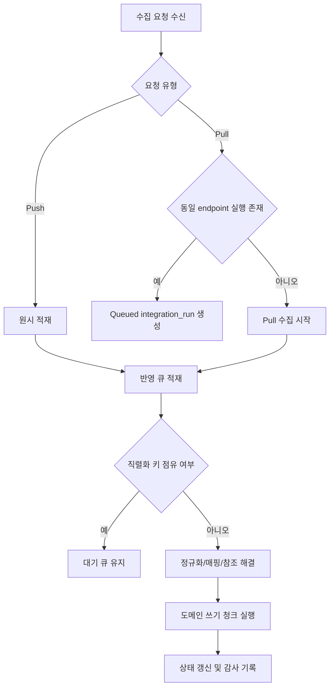
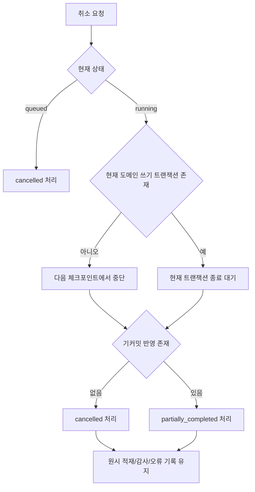

# 시스템 통합 DB 워커 슬롯 및 실행 취소/롤백 정책 초안

- 문서 목적: 시스템 통합 DB 백엔드의 실행 동시성 제어, 워커 슬롯 배분, 실행 취소 처리, 롤백 경계를 구현 전에 고정한다.
- 범위: `integration_run` 실행 슬롯, 큐 우선순위, 엔터티 직렬화, 취소 요청 처리, 트랜잭션 경계, 재시도 원칙
- 대상 독자: 백엔드 개발자, 아키텍트, 운영자, `DBA`, 기술 리드
- 상태: draft
- 최종 수정일: 2026-04-07
- 관련 문서: `docs/architecture/integration_run_state_transition_draft.md`, `docs/architecture/integration_data_ingestion_sequence_draft.md`, `docs/architecture/initial_release_physical_model_draft.md`, `docs/architecture/initial_release_ddl_draft.md`

## 문서 위치

- 위키 홈: [../README.md](../README.md)
- 아키텍처 위키: [./README.md](./README.md)
- 상위 설계 플랜: [./integration_backend_design_plan.md](./integration_backend_design_plan.md)

## 1. 배경

`integration_run` 상태 모델은 정리됐지만, 실제 구현에는 다음 두 기준이 더 필요하다.

- 어떤 실행을 동시에 돌릴 수 있고 어떤 실행은 반드시 직렬화해야 하는가
- 실행 취소 요청이 들어왔을 때 어디까지 중단하고 무엇을 롤백하지 않아야 하는가

이 기준이 없으면 `pull`/`push` 혼합 수집 환경에서 중복 반영, 최신성 충돌, 장시간 락, 부분 반영 후 불명확한 상태가 쉽게 생긴다.

## 2. 설계 목표

- 외부 수집 경로가 `pull` 이든 `push` 든 최종 도메인 쓰기 경로는 단일 직렬화 기준을 따른다.
- 취소 요청은 즉시 반영하되, 이미 커밋된 원시 적재와 도메인 반영을 무리하게 되돌리지 않는다.
- 롤백은 현재 트랜잭션 또는 현재 청크 범위에만 제한하고, 전체 실행 단위의 전역 롤백은 초기 릴리스에서 지원하지 않는다.
- 재시도는 기존 실행 재개가 아니라 새 `integration_run` 생성 원칙을 유지한다.

## 3. 워커 슬롯 정책

### 3.1 실행 도메인

워커 슬롯은 다음 세 축으로 구분한다.

- 수집 슬롯: 외부 시스템에서 데이터를 가져오거나 수신 이벤트를 적재하는 단계
- 반영 슬롯: 정규화, 식별자 매핑, 참조 해결, 도메인 쓰기 단계
- 운영 슬롯: 정합성 점검 배치, 재처리 큐, 운영 보완 배치 단계

초기 릴리스에서는 세 슬롯을 논리적으로 분리하고, 물리 워커 풀은 같더라도 슬롯 한도를 별도로 계산한다.

### 3.2 기본 동시성 원칙

- `integration_endpoint` 기준 `pull` 실행은 동시에 1건만 허용한다.
- 동일 `source_system + source_object_type + source_object_id` 에 대한 반영 작업은 동시에 1건만 허용한다.
- 도메인 쓰기는 `entity serialization key` 기준으로 직렬화한다.
- `push` 수신은 빠르게 적재만 하고, 실제 반영은 반영 슬롯에서 처리한다.
- 운영 배치 슬롯은 수집/반영 슬롯을 굶기지 않도록 별도 상한을 둔다.

### 3.3 엔터티 직렬화 키

직렬화 키는 다음처럼 적용한다.

- 프로젝트 반영: `project_external_key` 또는 내부 `project_id`
- 업무 항목 반영: `work_item_external_key` 또는 내부 `work_item_id`
- 조직 반영: `organization_code`
- 인력 반영: `workforce_code`
- 참조 정합성 재처리: 대상 엔터티의 기준 키

같은 직렬화 키를 가진 작업은 같은 시점에 하나만 `running` 상태가 될 수 있다.

### 3.4 우선순위 원칙

- 1순위: 외부 `push` 수신 후 반영 대기 작업
- 2순위: 운영자가 수동 실행한 `pull` 동기화
- 3순위: 주기 `pull` 배치
- 4순위: 재처리 큐
- 5순위: 정합성 점검 배치

운영 보완 배치는 안전장치이므로, 실시간 수집과 수동 운영 요청보다 낮은 우선순위를 가진다.

### 3.5 슬롯 소진 시 처리

- `push` 수신 API 는 `accepted` 로 응답하고 적재 후 큐에 적재한다.
- `pull` 실행 API 는 동일 엔드포인트 활성 실행이 있으면 새 실행을 `queued` 상태로 만든다.
- 동일 직렬화 키 충돌 시 현재 실행은 진행하고 후속 작업은 큐에서 대기한다.
- 운영 배치가 반영 슬롯을 점유 중이면 우선순위가 높은 수집 작업에 슬롯을 양보할 수 있어야 한다.

## 4. 실행 취소 정책

### 4.1 공통 원칙

- 취소는 강제 종료가 아니라 협조적 취소(`cooperative cancellation`)를 기본으로 한다.
- 현재 트랜잭션이 시작된 후에는 중간 강제 중단보다 현재 트랜잭션 종료 후 중단을 우선한다.
- 이미 커밋된 원시 적재, 감사 로그, 실행 이력은 취소를 이유로 삭제하지 않는다.
- 이미 커밋된 도메인 반영 결과는 초기 릴리스에서 자동 전역 롤백하지 않는다.

### 4.2 단계별 취소 처리

- `queued` 단계: 실행 시작 전 취소 가능. 최종 상태는 `cancelled`.
- 외부 수집 단계: 추가 호출/페이지네이션/폴링만 중단. 이미 적재된 `raw_ingestion_event` 는 유지.
- 정규화 단계: 현재 청크까지만 처리 후 중단. 정규화 실패/취소 사유는 실행 이력과 오류 기록에 남긴다.
- 참조 해결 단계: `pending_reference` 생성 후 중단 가능. 생성된 보류 기록은 유지.
- 도메인 쓰기 단계: 현재 트랜잭션 경계까지 처리 후 중단. 일부 커밋이 발생한 경우 최종 상태는 `partially_completed`.
- 운영 배치 단계: 현재 검사 단위 또는 현재 이슈 처리 단위 종료 후 중단.

### 4.3 최종 상태 판정

- 실제 반영이 전혀 없고 실행 시작 전에 취소된 경우: `cancelled`
- 원시 적재만 있고 도메인 반영이 없는 경우: `cancelled`
- 일부 정규화/참조 해결/도메인 반영이 커밋된 후 취소된 경우: `partially_completed`
- 취소 요청이 들어왔으나 이미 실행이 끝난 경우: 기존 완료 상태 유지

## 5. 롤백 범위

### 5.1 자동 롤백 대상

- 현재 열려 있는 도메인 쓰기 트랜잭션
- 현재 청크의 임시 계산 상태
- 아직 커밋되지 않은 정규화 결과 버퍼

### 5.2 자동 롤백 비대상

- `integration_run` 실행 이력
- `raw_ingestion_event`
- `sync_error`
- `audit_log`
- 이미 커밋된 `project`, `work_item`, 조직/인력 기준정보 변경
- 이미 생성된 `pending_reference` 와 재처리 큐 항목

### 5.3 초기 릴리스 비지원 범위

- 실행 전체 단위의 전역 롤백
- 여러 엔터티에 걸친 보상 트랜잭션 자동 생성
- 취소 후 이전 버전 자동 복원

이런 경우는 새 재처리 실행 또는 운영 보정 작업으로 해결한다.

## 6. 트랜잭션 경계

트랜잭션 경계는 다음처럼 제한한다.

- 원시 적재: 이벤트 1건 또는 소형 배치 단위
- 정규화/식별자 매핑: 계산 단계이므로 장기 트랜잭션 금지
- 도메인 쓰기: 엔터티 유형별 소형 청크 단위
- 상태 전이/감사 기록: 실행 이력 갱신과 같은 짧은 트랜잭션 단위

도메인 쓰기에서 긴 트랜잭션을 피해야 취소 지연과 락 전파를 줄일 수 있다.

## 7. 재시도와 취소의 관계

- 취소된 실행을 그대로 `running` 으로 되돌려 재개하지 않는다.
- 재시도는 항상 새 `integration_run` 을 생성한다.
- 새 실행은 `retry_of_run_id` 로 이전 실행을 참조한다.
- 이전 실행이 `partially_completed` 였다면, 새 실행은 최신성 판정과 멱등 키 검증을 통해 이미 반영된 변경을 건너뛴다.

## 8. 구현 규칙

- `integration_run` 은 `cancel_requested_at`, `cancel_requested_by`, `cancel_reason_code` 를 저장해 취소 요청 감사 정보를 남긴다.
- 워커는 각 청크 시작 전과 외부 호출 전후에 취소 플래그를 확인해야 한다.
- 도메인 쓰기 서비스는 직렬화 키 기반 락 또는 단일 파티션 소비 규칙을 적용해야 한다.
- 운영 API 는 실행 강제 종료가 아니라 취소 요청 등록 동작만 노출한다.

## 9. Mermaid 다이어그램

### 9.1 워커 슬롯 배분과 직렬화

### 9.2 취소와 롤백 판단

## 10. 후속 반영 대상

- `integration_run_state_transition_draft.md`
  취소 관련 보강 메모를 본 문서 기준으로 간략화할 수 있다.
- `initial_release_physical_model_draft.md`
  필요 시 취소 요청 감사 컬럼을 추가 검토한다.
- `initial_release_ddl_draft.md`
  취소 요청 감사 컬럼이 확정되면 함께 반영한다.
- `integration_backend_implementation_rollout_and_checklist_draft.md`
  워커 슬롯 정책과 취소/롤백 체크 항목을 개발 착수 체크리스트에 반영한다.
