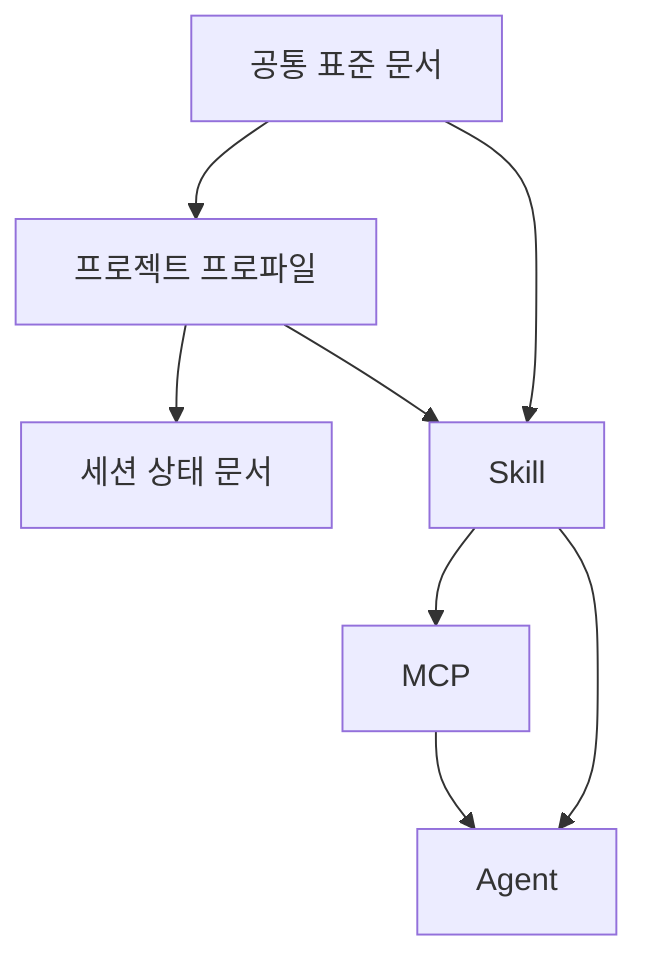

# 표준 워크플로우 구성안

- 문서 목적: 오늘 논의한 내용을 기준으로 표준 워크플로우를 문서, 프로젝트 프로파일, 세션 문서, skill, MCP, agent 계층으로 재구성하는 방향을 제안한다.
- 범위: 워크플로우 계층 구조, 공통 표준과 프로젝트 특화 규칙 분리, skill/MCP/agent 역할 분담, 단계별 도입 순서
- 대상 독자: 개발자, 운영자, AI agent, 아키텍트, 워크플로우 설계자
- 상태: draft
- 최종 수정일: 2026-04-18
- 관련 문서: `standard_workflow_draft.md`, `workflow_automation_plan.md`, `ai_agent_quickstart.md`, `code_index_strategy.md`, `workflow_agent_topology.md`

## 문서 위치

- 위키 홈: [../README.md](../README.md)
- 운영 위키: [./README.md](./README.md)
- 표준 작업 워크플로우 허브: [./standard_workflow_draft.md](./standard_workflow_draft.md)

## 1. 왜 재구성이 필요한가

현재 저장소는 이미 세션 시작, 작업 등록, 문서 동기화, 검증, 세션 인계 흐름을 문서로 상당 부분 정리해 두었다. 다만 이 상태는 “이 저장소에서 잘 작동하는 표준”에 가깝고, 여러 프로젝트와 새 세션에 공통 적용하려면 아래 문제를 더 분리해서 다뤄야 한다.

- 공통 규칙과 저장소 특화 규칙이 한 허브 안에 섞여 있다.
- 사람이 읽는 정책과 에이전트가 따라야 할 절차가 아직 같은 문서 층위에 놓여 있다.
- 반복 점검과 초안 생성 업무는 문서보다 tool 또는 자동화가 더 적합하다.
- agent 도입 시 어떤 역할을 어디까지 자동화해도 되는지 권한 경계가 아직 문서화되지 않았다.

이 문서는 위 문제를 줄이기 위해 표준 워크플로우를 계층 구조로 다시 묶는 제안서다.

## 2. 제안하는 전체 구조

표준 워크플로우는 아래 6계층으로 본다.

각 계층의 역할은 아래와 같다.

| 계층 | 역할 | 변경 빈도 | 공통화 수준 |
| --- | --- | --- | --- |
| 공통 표준 문서 | 전 프로젝트 공통 정책과 원칙 | 낮음 | 매우 높음 |
| 프로젝트 프로파일 | 저장소별 명령, 구조, 예외 규칙 | 중간 | 낮음 |
| 세션 상태 문서 | 현재 작업 상태와 진행 이력 | 높음 | 매우 낮음 |
| Skill | 절차, 판단 순서, 읽기 경로 | 중간 | 높음 |
| MCP | 검사, 탐색, 초안 생성 같은 구조화 도구 | 중간 | 높음 |
| Agent | skill과 MCP를 조합해 역할 단위로 실행 | 중간 | 높음 |

## 3. 계층별 권장 책임

### 3.1 공통 표준 문서

공통 표준 문서는 “왜 이렇게 하는가”와 “무엇을 반드시 지켜야 하는가”를 담당한다.

예:

- 세션 시작 순서
- 작업 상태값 정의
- 백로그 최소 필드
- 검증 수준 구분
- 세션 종료 시 인계 원칙
- 병합 후 문서 재확정 원칙

공통 표준 문서는 프로젝트에 복사할 수 있어야 하지만, 프로젝트 특화 명령이나 특정 디렉터리 구조까지 포함하면 안 된다.

### 3.2 프로젝트 프로파일

프로젝트 프로파일은 “이 저장소에서는 공통 표준을 어떻게 구체화하는가”를 담당한다.

예:

- 기본 빌드/테스트/실행 명령
- 문서 구조와 허브 위치
- 환경 기록 위치
- 도메인 특화 검증 포인트
- 이 저장소만의 병합/승인 규칙

핵심 원칙은 공통 규칙을 다시 쓰지 않고, 이 저장소의 차이점만 적는 것이다.

### 3.3 세션 상태 문서

세션 상태 문서는 사실 기록을 담당한다.

예:

- `session_handoff.md`
- `work_backlog.md`
- 날짜별 백로그

이 계층은 다른 어떤 계층보다 보수적으로 다뤄야 한다. 상태 문서는 agent 가 다루더라도, 실제 저장소와 검증 결과를 먼저 확인한 뒤에만 갱신해야 한다.

### 3.4 Skill

skill 은 “어떤 순서로 판단하고 어떤 문서를 먼저 보며 어떤 체크를 수행하는가”를 담당한다.

좋은 skill 의 특징:

- 사람이 읽어도 절차가 자연스럽다.
- 프로젝트 프로파일을 읽고 분기할 수 있다.
- 도구가 없을 때도 최소한 수동 절차로 동작한다.

### 3.5 MCP

MCP 는 반복적이고 구조화된 입력/출력이 있는 작업을 담당한다.

좋은 MCP 의 특징:

- 입력이 명확하다.
- 결과를 구조화해서 반환한다.
- 사람의 최종 판단을 대체하기보다 초안과 경고를 제공한다.

### 3.6 Agent

agent 는 역할 단위 실행자다.

좋은 agent 의 특징:

- 자신의 입력 문서와 출력 문서가 분명하다.
- 어떤 skill 을 따르고 어떤 MCP 를 호출하는지 명확하다.
- 상태 문서에 대해 어떤 권한을 가지는지 제한이 분명하다.

## 4. 문서 / skill / MCP / agent 분리 기준

같은 워크플로우 항목이라도 성격에 따라 담을 위치가 달라진다.

| 유형 | 적합한 위치 | 예시 |
| --- | --- | --- |
| 정책, 예외, 원칙 | 문서 | 상태값 의미, 병합 후 재확정 원칙 |
| 절차, 판단 순서 | skill | 세션 시작, 백로그 갱신, 문서 동기화 |
| 검사, 탐색, 초안 생성 | MCP | 최신 백로그 탐색, 링크 검사, 메타데이터 검사 |
| 역할 단위 실행 조합 | agent | session orchestrator, doc sync guardian |

핵심 판단 기준:

- “왜”를 설명하면 문서
- “어떤 순서”를 정하면 skill
- “읽고 만들고 검사”하면 MCP
- “무슨 책임으로 움직일지”를 정하면 agent

## 5. 초기 도입 권장 세트

### 5.1 문서

처음에는 아래 문서 세트를 공통 코어로 본다.

- `standard_workflow_draft.md`
- `workflow_documentation_sync.md`
- `workflow_validation.md`
- `branch_merge_document_policy.md`
- `code_index_strategy.md`

여기에 후속으로 아래 두 문서를 별도 실체화하는 것이 좋다.

- `global_workflow_standard.md`
- `project_workflow_profile_template.md`

### 5.2 Skill

1차 도입 skill 후보:

- `session-start`
- `backlog-update`
- `doc-sync`
- `merge-doc-reconcile`

### 5.3 MCP

1차 도입 MCP 후보:

- 최신 백로그 탐색
- 문서 메타데이터 검사
- 허브/링크 누락 검사
- 백로그 항목 템플릿 생성
- 변경 경로 기반 영향 문서 후보 출력

### 5.4 Agent

1차 도입 agent 후보:

- `session-orchestrator`
- `backlog-steward`
- `doc-sync-guardian`

2차 도입 agent 후보:

- `validation-coordinator`
- `merge-reconciler`
- `workflow-governor`

상세 역할은 [workflow_agent_topology.md](./workflow_agent_topology.md) 에서 정의한다.

## 6. 권장 운영 모델

여러 프로젝트에 이식 가능한 운영 모델은 아래 구조를 권장한다.

### 6.1 공통 레이어

- 공통 표준 문서
- 공통 skill 묶음
- 공통 MCP 서버 또는 도구 묶음
- 공통 agent 토폴로지

### 6.2 프로젝트 레이어

- `AGENTS.md`
- 프로젝트 프로파일
- 세션 상태 문서
- 프로젝트 특화 문서 허브

이 구조를 쓰면, 새 프로젝트 온보딩은 “공통 패키지 설치 + 프로젝트 프로파일 작성” 중심으로 간소화할 수 있다.

## 7. 상태 문서에 대한 보수적 원칙

세션 상태 문서는 가장 조심해서 다뤄야 한다.

반드시 지켜야 할 원칙:

- 존재하지 않는 백로그 파일을 사실처럼 인용하지 않는다.
- 외부 리뷰 코멘트보다 저장소의 실제 상태를 먼저 확인한다.
- 검증하지 않은 결과를 `done` 으로 확정하지 않는다.
- 세션 상태 문서는 기계적 병합보다 현재 시점 기준 재작성 원칙을 따른다.

이 원칙은 skill, MCP, agent 설계에도 모두 반영돼야 한다.

## 8. 단계별 도입 순서

1. 공통 코어 문서와 프로젝트 특화 규칙을 분리한다.
2. 프로젝트 프로파일 템플릿을 만든다.
3. 세션 시작과 문서 동기화 skill 을 먼저 만든다.
4. 메타데이터/링크 검사와 최신 백로그 탐색 MCP 를 먼저 만든다.
5. `session-orchestrator`, `backlog-steward`, `doc-sync-guardian` agent 를 먼저 정의한다.
6. 2~3개 프로젝트에 시범 적용해 과한 규칙인지 검증한다.

## 9. 이 저장소 기준 다음 산출물

이 문서를 기준으로 바로 이어서 만들기 좋은 산출물은 아래와 같다.

1. `global_workflow_standard.md`
2. `project_workflow_profile_template.md`
3. `workflow_skill_catalog.md`
4. `workflow_mcp_candidate_catalog.md`

2026-04-18 후속 정리 기준으로 위 산출물은 별도 저장소 [standard_ai_workflow](https://github.com/ykylee/standard_ai_workflow) 로 분리해 관리하기 시작했다. 이제 공통 코어와 템플릿은 원 저장소 내부 디렉터리 대신 독립 프로젝트에서 배포·확장할 수 있고, 본 문서는 이 저장소 안에서 그 구조를 설명하는 설계 원문 역할을 유지한다.

## 10. 현재 한계

- 본 문서는 구성안이며, 아직 공통 패키지나 실제 skill/MCP 구현은 없다.
- 프로젝트 프로파일 템플릿이 아직 별도 문서로 분리되지 않았다.
- 여러 프로젝트에 시범 적용하기 전에는 규칙이 과도한지 판단하기 어렵다.

## 다음에 읽을 문서

- 표준 작업 워크플로우 허브: [./standard_workflow_draft.md](./standard_workflow_draft.md)
- 워크플로우 자동화 계획: [./workflow_automation_plan.md](./workflow_automation_plan.md)
- AI agent 빠른 참조 문서: [./ai_agent_quickstart.md](./ai_agent_quickstart.md)
- 워크플로우 agent 토폴로지: [./workflow_agent_topology.md](./workflow_agent_topology.md)
